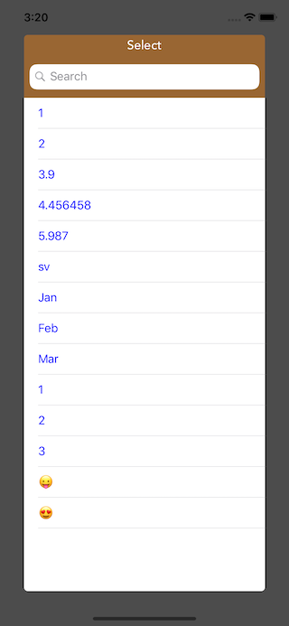
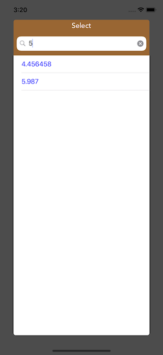

# PBPopupList

[](https://twitter.com/Peerbits)
[](https://github.com/Peerbits/PBPopupList/blob/master/LICENSE)
[](https://github.com/Peerbits/PBPopupList)
[](https://github.com/Peerbits/PBPopupList)

A Material Design popup list with search for iOS written in Swift.

[](Screenshots/1.png)
[](Screenshots/2.png)

## Demo

Do `pod try PBPopupList` in your console and run the project to try a demo.
To install [CocoaPods](http://www.cocoapods.org), run `sudo gem install cocoapods` in your console.

## Installation 📱

`PBPopupList` supports Swift 4.2 since version `1.0`.


### CocoaPods

Use [CocoaPods](http://www.cocoapods.org).

1. Add `pod 'PBPopupList'` to your *Podfile*.
2. Install the pod(s) by running `pod install`.
3. Add `import PBPopupList` in the .swift files where you want to use it


### Source files

A regular way to use PBPopupList in your project would be using Embedded Framework. There are two approaches, using source code and adding submodule.

Add source code:

1. Download the [latest code version](https://github.com/Peerbits/PBPopupList/archive/master.zip).
2. Unzip the download file, copy `PBPopupList` folder to your project folder

Add submodule

1. In your favorite terminal, `cd` into your top-level project directory, and entering the following command:
``` bash
$ git submodule add git@github.com:Peerbits/PBPopupList.git
```

After you get the source code either by adding it directly or using submodule, then do the following steps:

- Open `PBPopupList` folder, and drag `PBPopupList.xcodeproj` into the file navigator of your app project, under you app project.
- In Xcode, navigate to the target configuration window by clicking the blue project icon, and selecting the application target under the "Targets" heading in the sidebar.
- Open "Build Phases" panel in the tab bar at the top of the window, expend the "Target Dependencies" group and add `PBPopupList.framework` under PBPopupList icon in the popup window by clicking `+`. Similarly, you can also add `PBPopupList.framework` in "Embedded Binaries" under "General" tab.

## Basic usage ✨

```swift
let popupList: PBPopupList = PBPopupList(Viewcontroller: self)

let arrayVal = [1,2,3.9,4.456458,5.987,"sv","Jan","Feb","Mar",1,2,3,"😛","😍"] as [Any]

// The list of items to display. Can be changed dynamically
popupList.createTableview(arrayVal, withTitle: "Select") { (index) in        
    print("array value:\(arrayVal)")
    print("search result is:\(arrayVal[index])")
}
```

Optional properties:

```swift
// To customize popup according to your requirements
popupList.rowHeight = 50
popupList.searchPlaceHolder = "Search"
popupList.isSearch = true
popupList.headerColor = .brown
popupList.cellTextColor = .blue
popupList.cellBackgroundColor = .white
popupList.isMultilineModeEnabled = true
```

Display actions:

```swift
popupList.createTableview(arrayVal, withTitle: "Select") { (index) in        
    print("array value:\(arrayVal)")
    print("search result is:\(arrayVal[index])")
}
```

### Dismiss modes

As soon as the user interact with anything else than the PBpopup List, the PBpopup List is dismissed.


## Customize UI 🖌

You can customize these properties of the PBPopupList:

- `isSearch`: enable search option in PBPopup List.
- `cellTextColor`: the color of the text for each cells of the PBPopup List.
- `cellBackgroundColor`: the background color of the PBPopup List.
- `headerColor`: the background color of the hedear view of PBPopup List.
- `rowHeight`: the height of the PBPopup List cells.
- `isMultilineModeEnabled`: multiline text supported in the PBPopup List cells.

You can change them through each instance of `PBPopupList` like this for example:

```swift
popupList.rowHeight = 50
popupList.searchPlaceHolder = "Search"
popupList.isSearch = true
popupList.headerColor = .brown
popupList.cellTextColor = .blue
popupList.cellBackgroundColor = .white
popupList.isMultilineModeEnabled = true
```

## Requirements

* Xcode 8+
* Swift 3.0
* iOS 8+

## License

This project is under MIT license. For more information, see `LICENSE` file.

It will be updated when necessary and fixes will be done as soon as discovered to keep it up to date.

You can find me on Twitter [@peerbits](https://twitter.com/Peerbits).

Enjoy!
